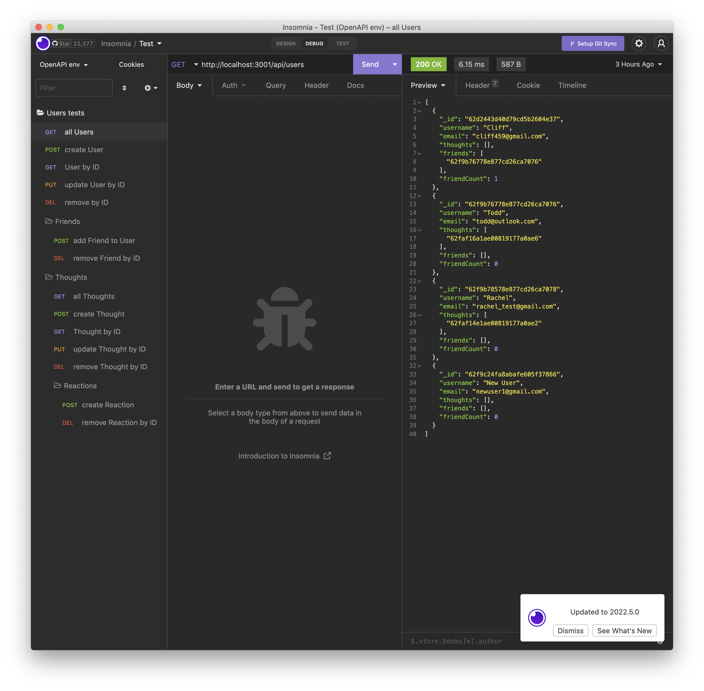

# 18-Social-Network-API

## Table of Contents-
- [Social Network API](#social-network-api)
  - [Table of Contents-](#table-of-contents-)
  - [Licensing](#licensing)
  - [Description](#description)
  - [Installation](#installation)
  - [Screenshots](#screenshots)
  - [Usage](#usage)
  - [Credits](#credits)
  - [Contributing](#contributing)
  - [Testing](#testing)
  - [Additional Info](#additional-info)

## Licensing

Link: [MIT License](https://opensource.org/licenses/MIT)

## Description

This application is an API "back-end" interface with a MongoDB database that is accessed via the Mongoose ORM. It provides the following basic functions which accept data and return data in JSON format:

* GET all Users
* GET a single User by ID
* POST to create a new User
* PUT to update User data (by ID)
* DELETE to remove a User ID record
* POST to add a Friend to a User ID
* DELETE to remove a Friend by ID
* GET to see all User "Thoughts"
* GET to see a single "Thought" by ID
* POST to create a new "Thought"
* PUT to update a "Thought" by ID
* DELETE to remove a "Thought" by ID
* POST to create a "Reaction" to an existing "Thought"
* DELETE to remove a "Reaction" from an existing "Thought"

## Installation

This app uses Node.js, the `package.json` file has all the dependencies inside. Copying the directory sturcture as-is and going to the root level then running the command `npm install` will collect the required modules and install them.

## Screenshots

The video walk-through of the API operation is on YouTube at: [https://youtu.be/-UwLedE5ikE](https://youtu.be/-UwLedE5ikE)

This is a mock-up image of the API being tested with Insomnia:

## Usage

The app is launched by entering `node server.js` in the command window when inside the directory holding files. The API interface is accessed through HTTP methods of GET, POST, PUT and DELETE. The MongoDB database is accessed via the Mongoose ORM from these methods/routes.

## Credits

[MongoDB](https://www.mongodb.com/) - A "NoSQL" rdatabase that uses a JSON-like document model

[Mongoose.js](https://mongoosejs.com/) - The ORM for MongoDB in Node.js

API routing is provided by [Express.js](https://expressjs.com/)

## Contributing

  [Contributor Covenant](https://www.contributor-covenant.org/)

## Testing

  No testing is provided.

## Additional Info

- Github: [cliff-rosenberg](https://github.com/cliff-rosenberg)
- Email: cliff459 AT icloud.com